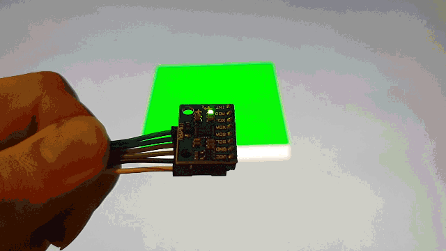

# Raspberry-Pi-WebGL-Gyroscope
Node.JS Server that visualizes the rotation of an MPU 6050 gyroscope

Tutorial: https://tutorials-raspberrypi.de/raspberry-pi-mpu-6050-rotationssensor-webgl-nodejs-server/
